# 🏗️ Docker化架构设计

## 系统架构图

```mermaid
graph TB
    User[用户浏览器] --> Web[Web容器<br/>Nginx:Alpine<br/>Port 80]
    Web --> Server[Server容器<br/>Go 1.24.5<br/>Port 8080]
    Server --> Uploads[(上传文件<br/>Volume挂载)]
    
    Web -.健康检查.-> HealthWeb[/api/v1/health]
    Server -.健康检查.-> HealthServer[/api/v1/health]
    
    Compose[Docker Compose] --> Web
    Compose --> Server
    Compose --> Network[ai-hackathon-network]
    
    Web --> Network
    Server --> Network
```

## 容器架构

### 前端容器（web）

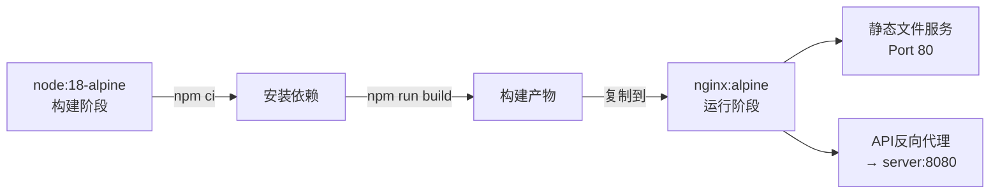

**特性**:
- 📦 多阶段构建，最终镜像仅约20MB
- 🚀 Nginx高性能静态文件服务
- 🔄 自动API反向代理
- 💾 Gzip压缩 + 静态资源缓存
- ♻️ SPA路由支持

### 后端容器（server）

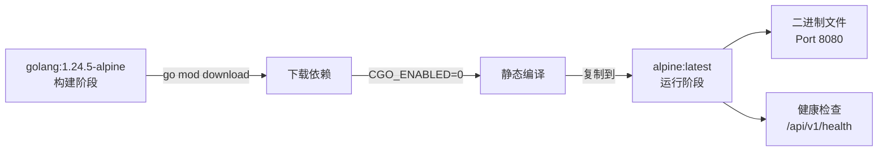

**特性**:
- 🔒 静态编译，无外部依赖
- 📦 最终镜像仅约15MB
- ⚡ Alpine Linux极致精简
- 🏥 内置健康检查
- 📁 持久化上传文件

## 网络架构

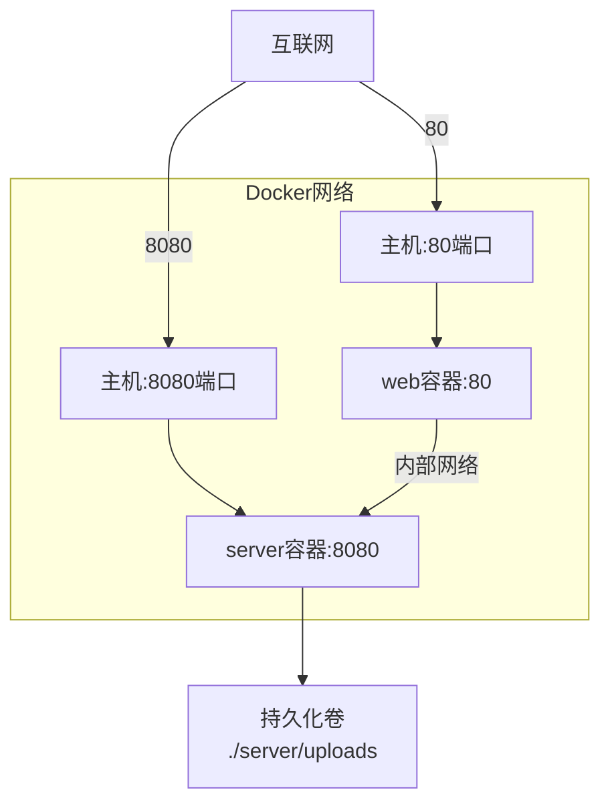

## 构建流程

### 前端构建流程

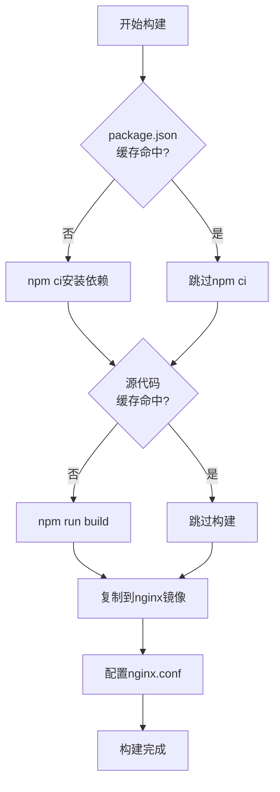

### 后端构建流程

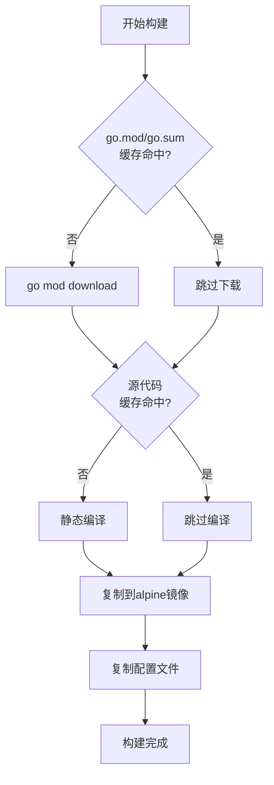

## 部署流程

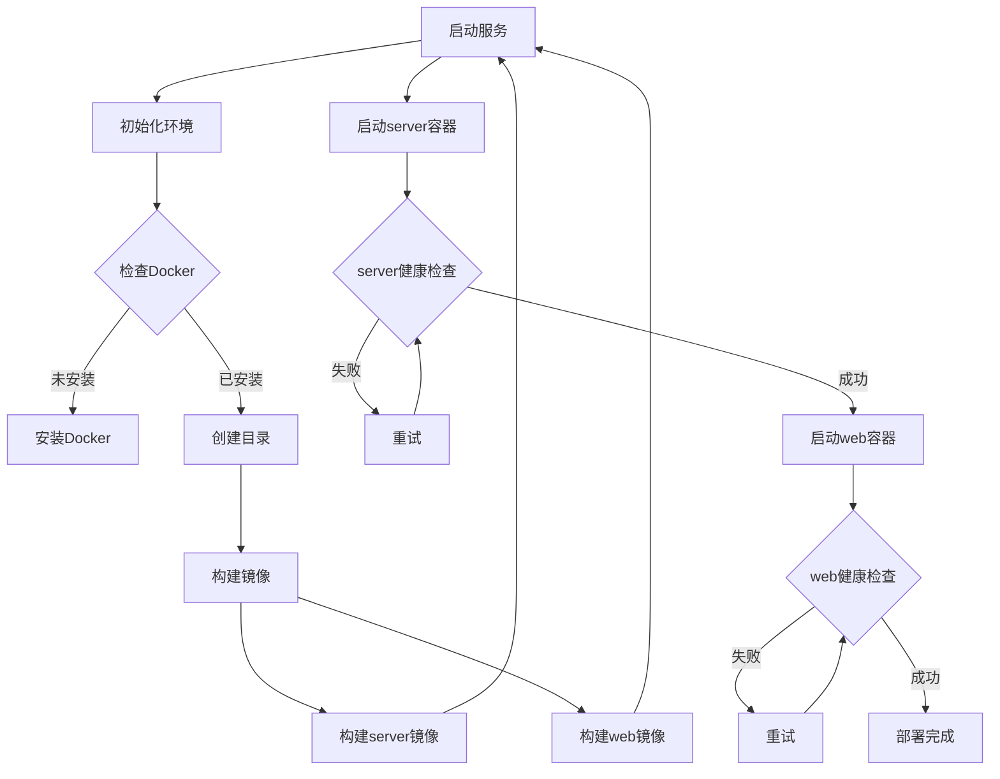

## 数据流

### 用户请求流程

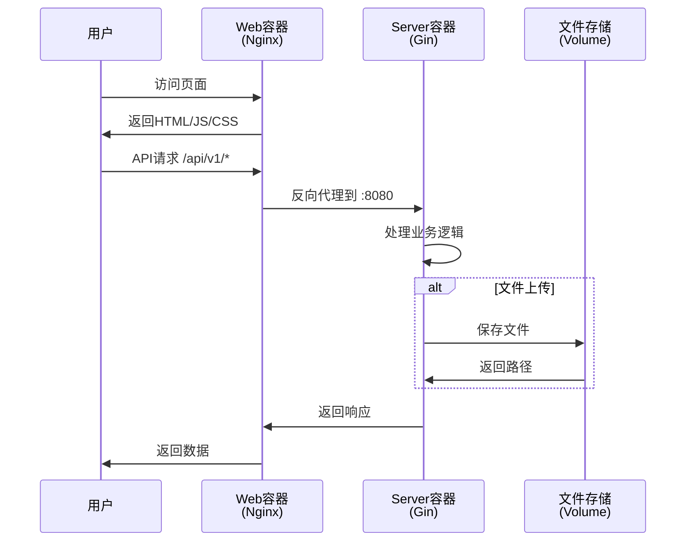

### 健康检查流程

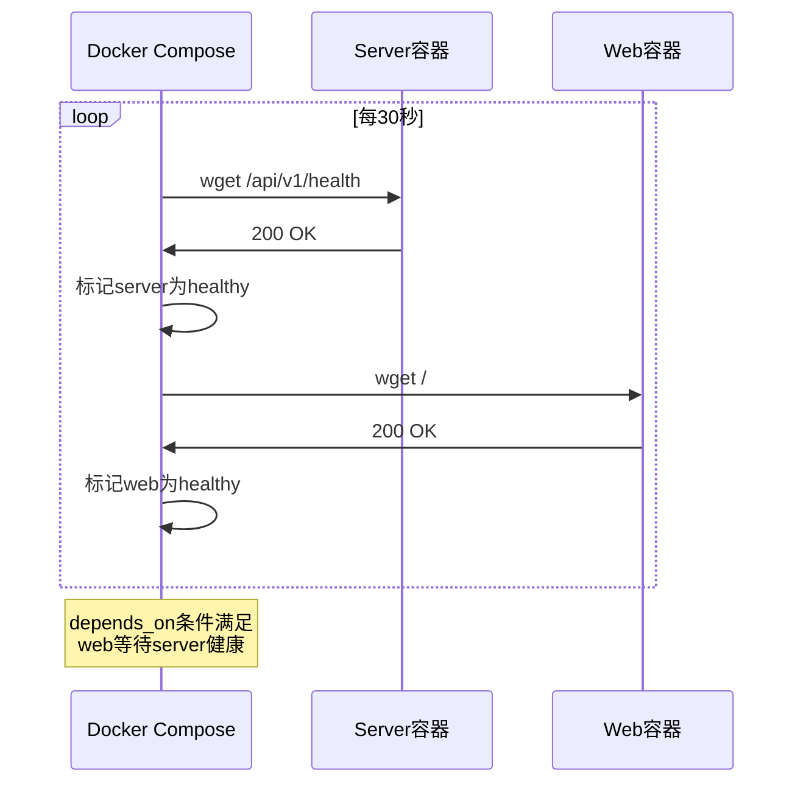

## 文件结构映射

### 构建时文件映射

```
主机                                容器内部
────────────────────────          ────────────────────────
server/
├── go.mod                  →    /build/go.mod
├── go.sum                  →    /build/go.sum
├── cmd/                    →    /build/cmd/
├── internal/               →    /build/internal/
└── configs/                →    /build/configs/

↓ 编译后 ↓

server/                          /app/
└── [构建产物]              →    ├── server (二进制)
                                 └── configs/config.yaml
```

### 运行时文件映射

```
主机                                容器内部
────────────────────────          ────────────────────────
server/
├── uploads/                ⇄    /app/uploads/
└── configs/config.yaml     →    /app/configs/config.yaml

web/
└── dist/                   →    /usr/share/nginx/html/
```

## 资源分配

### 推荐配置

| 容器 | CPU | 内存 | 磁盘 |
|------|-----|------|------|
| server | 0.5-1核 | 256-512MB | 100MB |
| web | 0.25-0.5核 | 128-256MB | 50MB |

### 可配置限制

```yaml
deploy:
  resources:
    limits:
      cpus: '1'
      memory: 512M
    reservations:
      cpus: '0.5'
      memory: 256M
```

## 安全架构

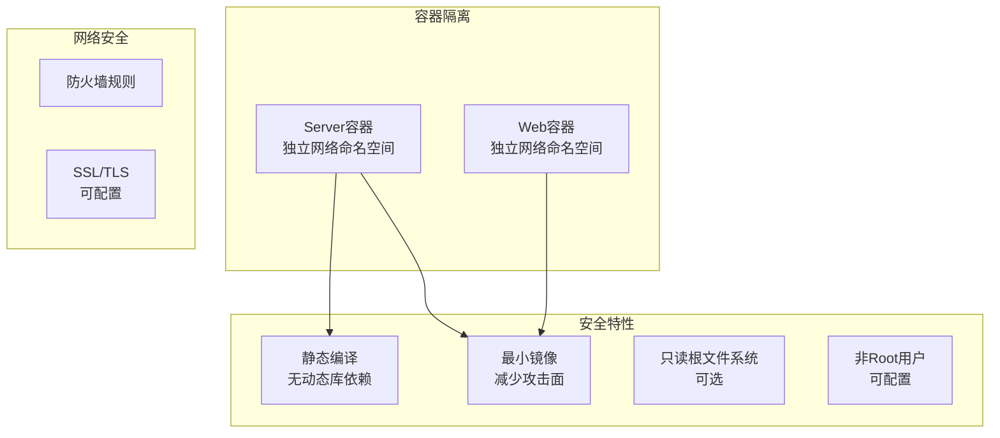

## 扩展架构

### 水平扩展

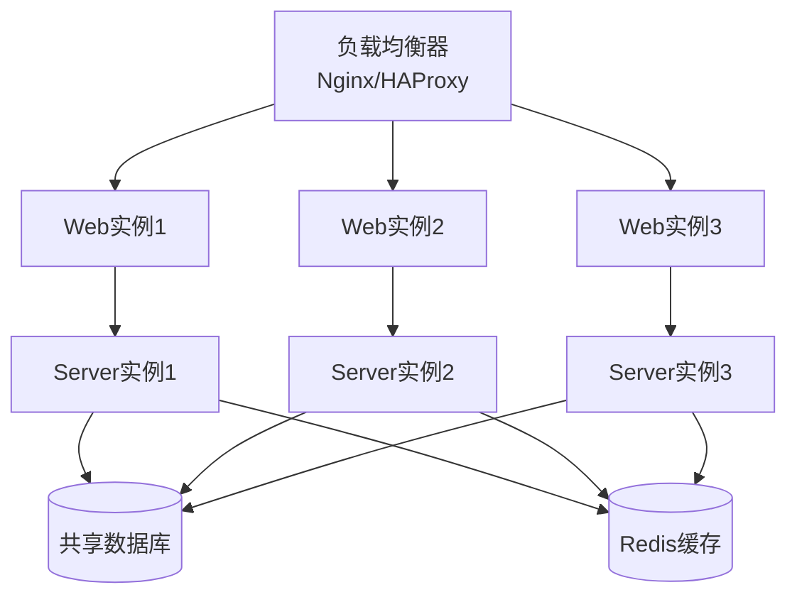

### 微服务扩展

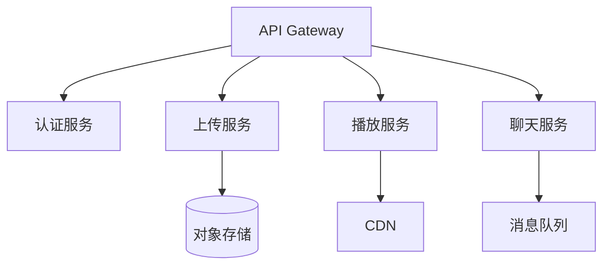

## 监控架构

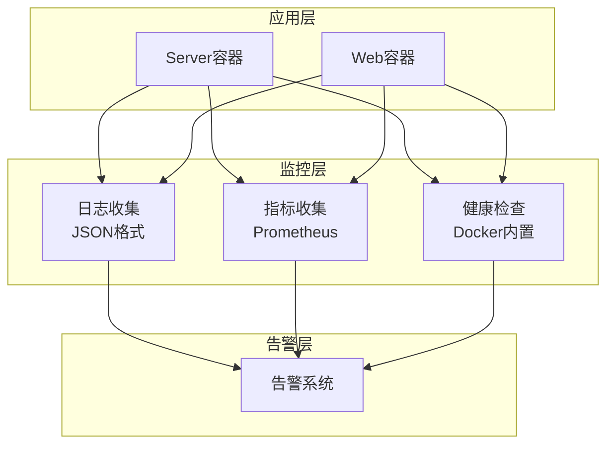

## 备份架构

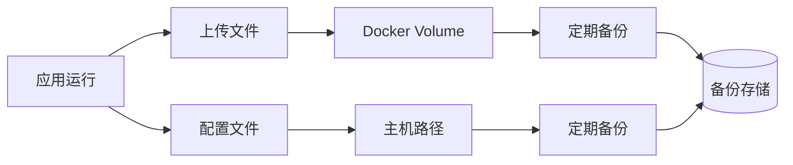

## 总结

本Docker化架构具有以下优势：

### ✅ 性能优势
- 多阶段构建，镜像小巧（总计<50MB）
- 构建缓存优化，加速开发迭代
- Nginx高性能静态文件服务
- Alpine Linux极致精简

### ✅ 可靠性优势
- 健康检查确保服务可用
- 自动重启策略
- 依赖隔离，版本锁定
- 容器化环境一致性

### ✅ 安全性优势
- 静态编译，无外部依赖
- 最小基础镜像
- 容器隔离
- 可配置安全加固

### ✅ 运维优势
- 一键部署
- 标准化配置
- 日志集中管理
- 易于扩展

---

**版本**: 1.0.0  
**最后更新**: 2025-10-24
